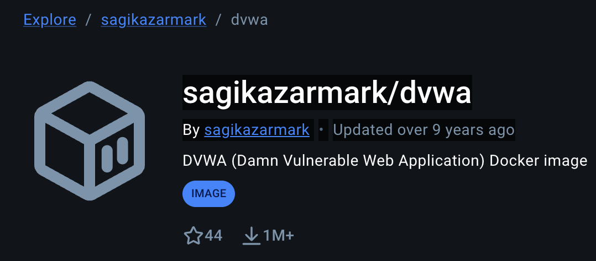
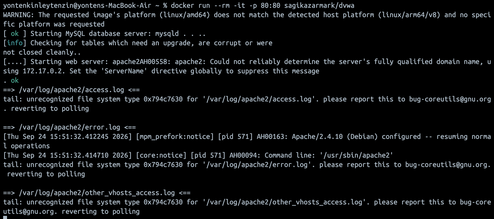
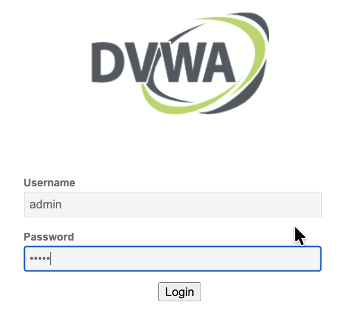
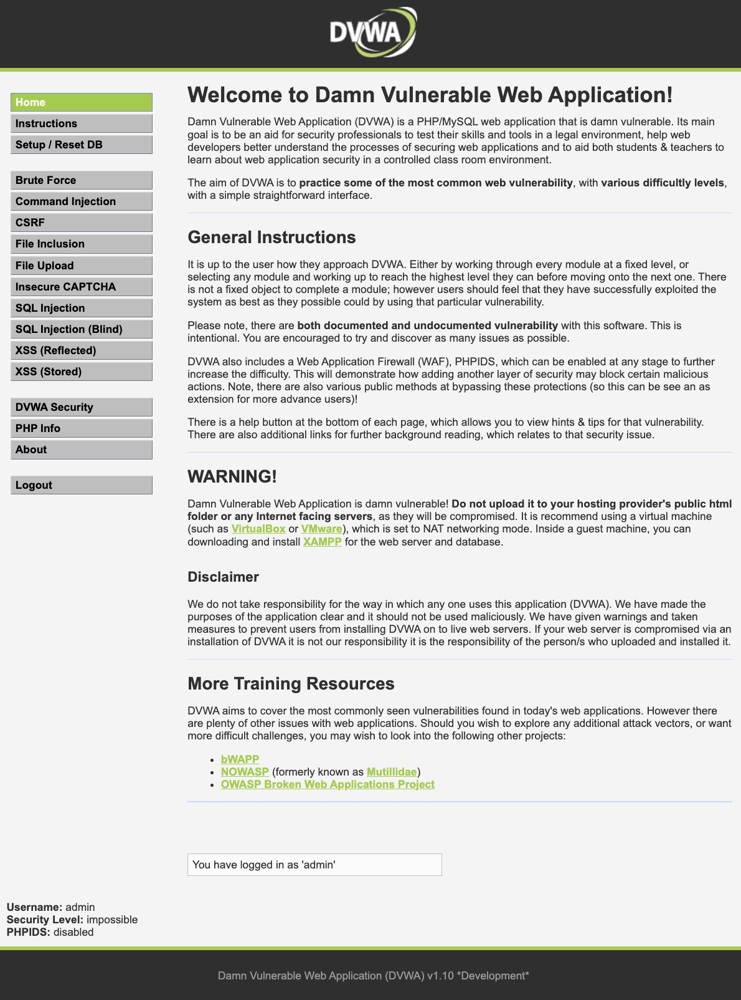
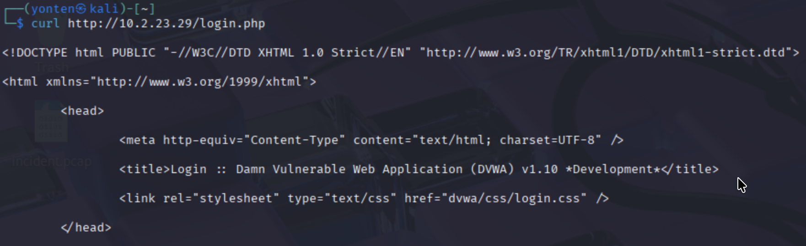
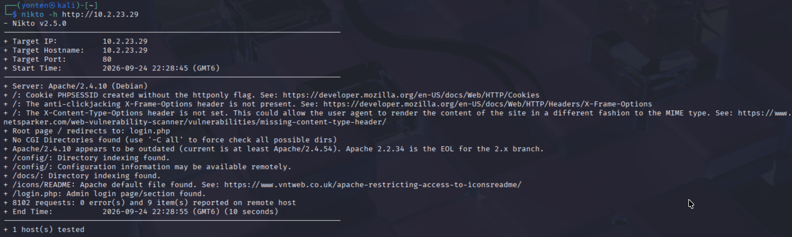

# Assignment 1 
## Nikto 

### What is Nikto?
Nikto is a command-line tool that scans web servers for things like:
- Outdated software versions
- Dangerous or misconfigured files/scripts
- Missing security headers
- Default files that shouldn't be exposed
- Common misconfigurations

### Architecture 
- Attacker: Kali Linux VM (VMware Fusion, Bridged network)
- Victim: Host OS Mac.running DVWA(Damn Vulnerable Web Application) via Docker

### Prerequsitries 
- Nikto installed on the Kali VM
- A vulnerable web application (DVWA) running on the host machine
- Both machines reachable on the same network 

### Procedure 
1. First, I downloaded the DVWA docker image from Docker Hub.


2. Then ran the docker image using the following command:

```
docker run --rm -it -p 80:80 sagikazarmark/dvwa
```



3. The DVWA website was then accessible from my host (Mac) browser.



4. After setting up the database and logging in with the default credentials (admin /password), I got the DVWA home page.



5. Next, I retrieved the Mac's IP address (ifconfig) and verified that the vulnerable website was reachable from the VM (attacker machine) using curl.


6. Finally, I ran the Nikto scan against the DVWA server from the Kali VM.

Command used:
```
nikto -h http://10.2.23.29
```

Scan output:


### Findings and Interpretation

|  | Finding | Risk Level | Explanation |
|---|---|---|---|
| 1 | `PHPSESSID` cookie created without the `HttpOnly` flag | Medium | The `HttpOnly` flag is missing, so JavaScript can access the session cookie. If an XSS vulnerability is present, the cookie could potentially be stolen and used to hijack the session. |
| 2 | Missing `X-Frame-Options` header | Medium | The website can be loaded inside an iframe on another webpage. This can make the site vulnerable to clickjacking, where a user may be tricked into clicking something without realizing it. |
| 3 | Missing `X-Content-Type-Options` header | Low–Medium | The browser may try to guess the type of a file instead of following the declared content type. This can create additional security risks in some situations. |
| 4 | Apache 2.4.10 is outdated | High | The installed Apache version is old and may not contain security fixes available in newer versions. Older software can also have known vulnerabilities. |
| 5 | `/config/` directory indexing is enabled | High | The contents of the `/config/` directory can be listed. This exposes information about files stored in the directory and may reveal sensitive configuration files. |
| 6 | `/config/` configuration information may be available remotely | High | Configuration files can contain important information such as database settings, credentials, or internal paths. If sensitive files are accessible, this can lead to information disclosure. |
| 7 | `/docs/` directory indexing is enabled | Low | The files inside the `/docs/` directory can be listed. This may expose internal documentation or other files that do not need to be publicly visible. |
| 8 | `/icons/README` default Apache file found | Informational | The default Apache file is still available on the server. Removing unnecessary default files can make the server cleaner and reduce unnecessary information exposure. |
| 9 | `/login.php` admin login page discovered | Informational | The scan identified the login page. This is not a vulnerability by itself, but it provides information about the location of the authentication page. |


### Risk Analysis
The main issues found were the outdated Apache version and the exposed /config/ directory. The old Apache version may contain known vulnerabilities, while the exposed configuration directory could reveal sensitive information.

The missing security headers and HttpOnly flag are also security concerns. They do not directly mean the server is compromised, but fixing them can provide better protection against attacks such as clickjacking and session theft.

### Recommendations
- Update Apache to a newer supported version.
- Disable directory listing.
- Restrict access to /config/ and /docs/.
- Add X-Frame-Options and X-Content-Type-Options.
- Enable the HttpOnly flag for session cookies.
- Remove unnecessary default Apache files.

### Conclusion
The Nikto vulnerability assessment identified 9 findings on the DVWA server. The main problems were outdated Apache version, directories that were exposed, lack of security headers, and insecure session cookie.

The findings were anticipated since DVWA was made with vulnerabilities in order to ensure security training. The scan demonstrates how Nikto can quickly find some common web server security issues.